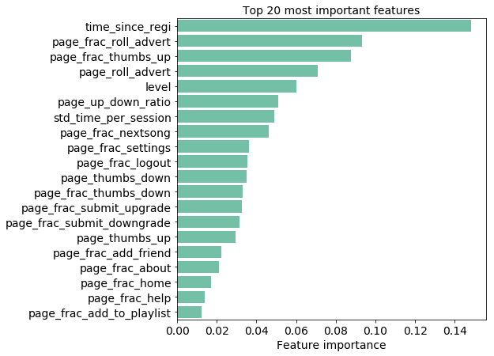

# Predicting churns with Spark

This project uses PySpark to predict churn based on a 12GB dataset of a fictitious music service platform, "Spartify". Check out my [blog post](https://medium.com/@angangli/predicting-churn-with-apache-spark-b9989008fc9a) for more details!

## 1. Problem to solve

Build a machine learning model to identify users who leave the service (i.e. "churn").

## 2. Datasets

- **User activity dataset** from [Udacity](https://www.udacity.com/)  
    The dataset logs user demographic information (e.g. user name, gender, location State) and activity (e.g. song listened, event type, device used) at individual timestamps.

- **Census regions table** from [cphalpert's GitHub](https://github.com/cphalpert/census-regions)  
  The table links State names to geographical divisions.

A small subset (~120MB) of the full dataset was used for exploratory data analysis and pilot modeling; the full dataset (~12GB) was used for tuning the machine learning model.

## 3. What I did

1. Data loading

   - Load subset from JSON
   - Assess missing values

2. Exploratory data analysis

   - Overview of numerical columns: descriptive statistics
   - Overview of non-numerical columns: possibel categories
   - Define churn as cancellation of service
   - Compare behavior of churn vs. non-churn users in terms of:
     - Usage at different hours of the day
     - Usage at different days of a week
     - User level (free vs. paid)
     - Event types (e.g. add a friend, advertisement, thumbs up)
     - Device used (e.g. Mac, Windows)
     - User location (e.g. New England, Pacific)
     - Time from downgrade to churn

3. Feature engineering for machine learning

   - Create features on per user basis:
     - Latest user level
     - Time since registration
     - Gender of user
     - Time, number of artists, number of songs, and number of session that user has engaged
     - Mean and standard deviation of the number of songs listened per artist, the number of songs listened per session, and time spent per session
     - Device used
     - Count and proportion of each event type
     - User location
   - Remove strongly correlated features (one from each pair)
   - Transform features to have distributions closer to normal
   - Compile feature engineering code to scale up later

4. Develop machine learning pipeline

   - Split training and testing sets
   - Choose evaluation metrics
   - Create functions to build cross validation pipeline ([documentation](https://spark.apache.org/docs/2.1.0/ml-tuning.html)), train machine learning model, and evaluate model performance
   - Initial model evaluation with:
     - Naive predictor
     - Logistic regression ([documentation](https://spark.apache.org/docs/2.1.1/api/python/pyspark.ml.html#pyspark.ml.classification.LogisticRegression))
     - Random forest ([documentation](https://spark.apache.org/docs/2.1.1/api/python/pyspark.ml.html#pyspark.ml.classification.RandomForestClassifier))
     - Gradient-boosted tree ([documentation](https://spark.apache.org/docs/2.1.1/api/python/pyspark.ml.html#pyspark.ml.classification.GBTClassifier))

5. Scale up machine learning on the full dataset on AWS

   - Tune hyperparameters of gradient-boosted tree
   - Evaluate model performance
   - Evaluate feature importance

## 4. Results

- Model performance on testing set:

    |testing accuracy score|testing F1 score|
    |--------|--------|
    | 0.8387 | 0.8229 |

    Note that the scores are reasonably well, although not subperb. One limitation is that I was not able to run the model for a long time period given my AWS tier, so only few hyperparameters were tuned. The model performance could be further improved by tuning broader ranges of hyperparameters.

- Churns relate to users who have received more advertisements, disliked songs more often than liked, and registered more recently.

    

- Check out my [blog post](https://medium.com/@angangli/predicting-churn-with-apache-spark-b9989008fc9a) for more details!

## 5. Installation

- **Prototype on local machine:** The code was developed using the Anaconda distribution of Python, versions 3. Libraries used include `PySpark`, `Pandas`, `Seaborn`, and `Matplotlib`.

- **Cloud deployment on [AWS EMR](https://aws.amazon.com/):**
  - Release: emr-5.20.0
  - Applications: Spark: Spark 2.4.0 on Hadoop 2.8.5 YARN with Ganglia 3.7.2 and Zeppelin 0.8.0
  - Instance type: m4.xlarge
  - Number of instance: 3
